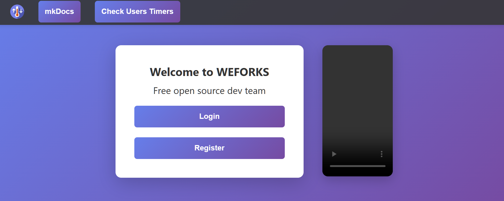

<h1 align="center">🧩 WFORK-Fronend-Page</h1>

  Основная страница сообщества

  <!-- GitHub badges -->
  
  
  

## 🚀 Live Website

> **Try it instantly:**  
> https://weforks.org/

## 📸 Preview

  

## ⚙️ RUN

docker compose up -d --build 

## 🤝 Contributing

Fork → branch → commit feat/fix

  
DEV Log

- [ ] v0.0.13 - создать нижнию панель с ссылкой на телеграм группу 
- [ ] v0.0.12 - создать n8n flow для wfork-frontend docker rebuild
- [x] v0.0.11 - added .git\workflows\deploy_n8n.yml fot auto deploy 
- [x] v0.0.10 - added .gitignore  
- [x] v0.0.9 - добавленно локальное видео 
- [x] v0.0.8 - добавлен ссылка к сайту в README.md 
- [x] v0.0.7 - добавлен screenshot в README.md
- [x] v0.0.6 - исправлены ссылки в шамке md
- [x] v0.0.5 - добавлен логотип 
- [x] v0.0.4 - добавлена кнопка User Timer
- [x] v0.0.3 - добавлена кнопка wiki
- [x] v0.0.2 - добавлена кнопка регистрации
- [x] v0.0.1 - добавлена кнопка логин

  
Github CHEATSHEET

## Update repository

git add .  
git commit -m "README.md update2"  
git push

## 📄 License

Licensed under the MIT License.

Made with ❤️ &nbsp;

